---
## Front matter
title: "Отчёт по научной работе"
subtitle: "Ознакомление сос средством моделирования mininet"
author: "Саргсян Арам Грачьяевич"

## Generic otions
lang: ru-RU
toc-title: "Содержание"

## Bibliography
bibliography: bib/cite.bib
csl: pandoc/csl/gost-r-7-0-5-2008-numeric.csl

## Pdf output format
toc: true # Table of contents
toc-depth: 2
lof: true # List of figures
lot: true # List of tables
fontsize: 12pt
linestretch: 1.5
papersize: a4
documentclass: scrreprt
## I18n polyglossia
polyglossia-lang:
  name: russian
  options:
	- spelling=modern
	- babelshorthands=true
polyglossia-otherlangs:
  name: english
## I18n babel
babel-lang: russian
babel-otherlangs: english
## Fonts
mainfont: PT Serif
romanfont: PT Serif
sansfont: PT Sans
monofont: PT Mono
mainfontoptions: Ligatures=TeX
romanfontoptions: Ligatures=TeX
sansfontoptions: Ligatures=TeX,Scale=MatchLowercase
monofontoptions: Scale=MatchLowercase,Scale=0.9
## Biblatex
biblatex: true
biblio-style: "gost-numeric"
biblatexoptions:
  - parentracker=true
  - backend=biber
  - hyperref=auto
  - language=auto
  - autolang=other*
  - citestyle=gost-numeric
## Pandoc-crossref LaTeX customization
figureTitle: "Рис."
tableTitle: "Таблица"
listingTitle: "Листинг"
lofTitle: "Список иллюстраций"
lotTitle: "Список таблиц"
lolTitle: "Листинги"
## Misc options
indent: true
header-includes:
  - \usepackage{indentfirst}
  - \usepackage{float} # keep figures where there are in the text
  - \floatplacement{figure}{H} # keep figures where there are in the text
---

# Теоритическое введение

## Mininet 

Mininet — это симулятор сетевых топологий на основе виртуаилизации,
который позволяет моделировать и изучать поведение сетей в
контролируемой среде, основанный на использовании виртуальных машин и
пространств имен Linux для создания изолированных сетевых
узлов. Моделирование сетевых топологий с помощью Mininet позволяет
исследовать различные сетевые протоколы, маршрутизацию, управление
трафиком и т.д. Возможности моделирования с помощью Mininet включают
создание виртуальных сетевых узлов, конфигурирование топологий (связь
между узлами, настраивать IP-адреса, маршрутизацию), имитировать
различные условия сети, такие как задержки, потери пакетов и
пропускную способность, интеграция с контроллерами для исследования
новых протоколов и алгоритмов.
 
## Iperf3

iPerf3 представляет собой кроссплатформенное клиент-серверное приложение с открытым исходным кодом,
которое можно использовать для измерения пропускной способности между
двумя конечными устройствами. iPerf3 может работать с транспортными протоколами TCP, UDP и SCTP:

TCP и SCTP:
- измерение пропускной способности
- возможность задать размер MSS/MTU
- отслеживание размера окна перегрузки TCP (CWnd)

UDP:
- измерение пропускной способности
- измерение потери пакетов
- измерение колебания задержки (jitter)
- поддержка групповой рассылки пакетов (multicast).

# Процесс установки

1. Для работы с данным средством я скачал рекомендуемый к установке образ виртуальной машины: mininet-2.3.0-
210211-ubuntu-20.04.1-legacy-server-amd64-ovf. Для работы из под операционной системы Windows дополнительно установил Putty и VcXsrv Windows X Server. 

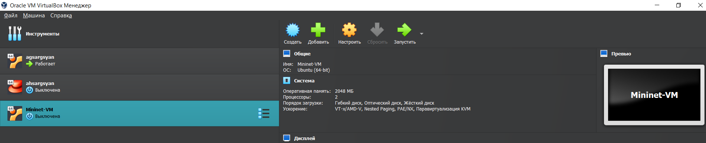{ #fig:001 width=70% height=70% } 

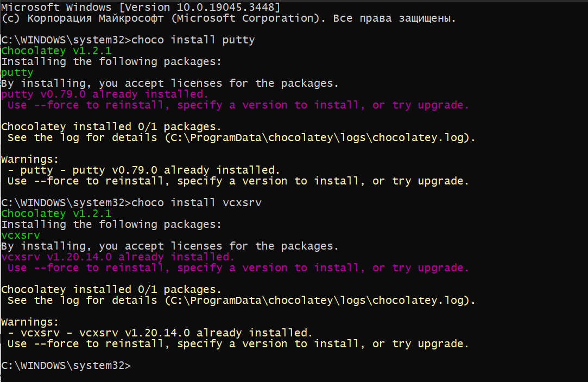{ #fig:002 width=70% height=70% } 

2. После запуск виртуальной машины и xserver, соединился с помощью консоля putty по ssh с ip адрессом 192.168.56.101

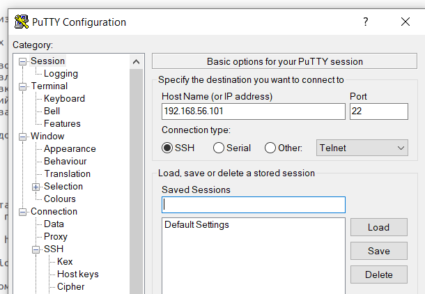{ #fig:003 width=70% height=70% }

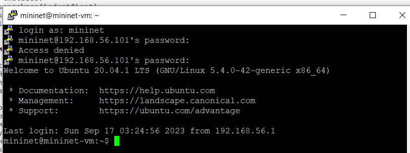{ #fig:004 width=70% height=70% }

3. Настроил соединения X11 для суперпользователя

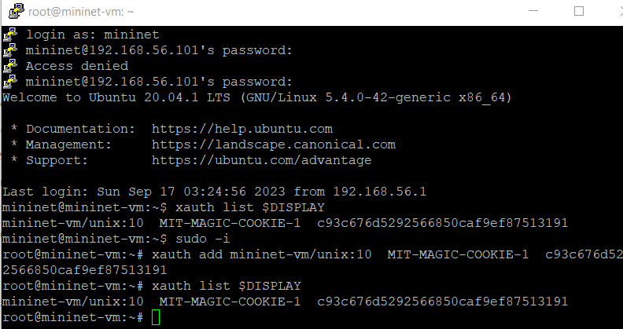{ #fig:005 width=70% height=70% }

# Процесс моделирования

1. Изучил основные команды mininet, в miniedit запустил простую топологию с двумя хостами и одним коммутатором

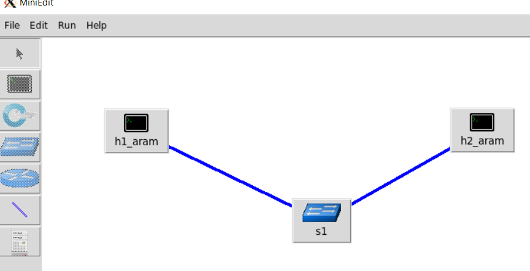{ #fig:006 width=70% height=70% }

2. Проверил работаспособность соединения 

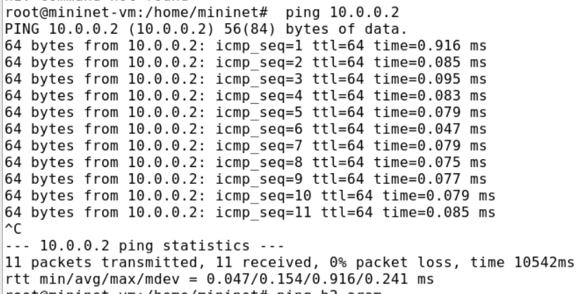{ #fig:007 width=70% height=70% }

3. Установил приложение iperf3 

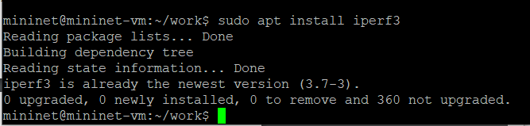{ #fig:008 width=70% height=70% }

4. Смоделировал простую тополгию с двумя хостами и коммутатром

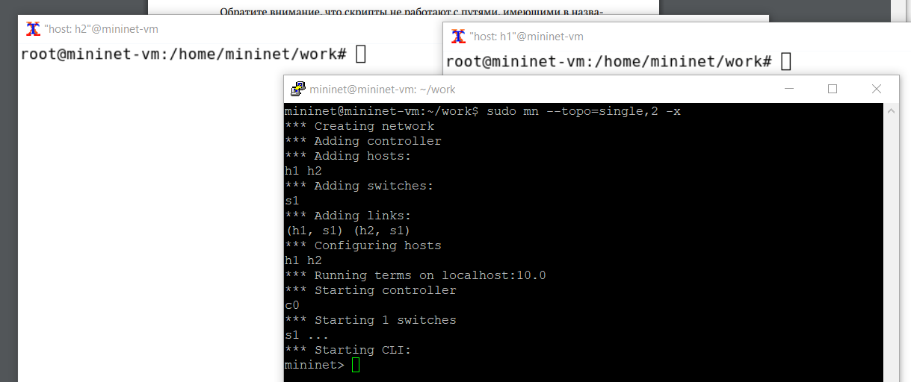{ #fig:009 width=70% height=70% }

5. Провел простейший интерактивный эксперимент по измерению пропускной способности в iperf3 и в терминале mininet. Как мы видим, при первом тесте потери пакетов значильно меньше (9 против 152), пропусная способность тоже больше в первом случае, как и размер окна перегрузки.

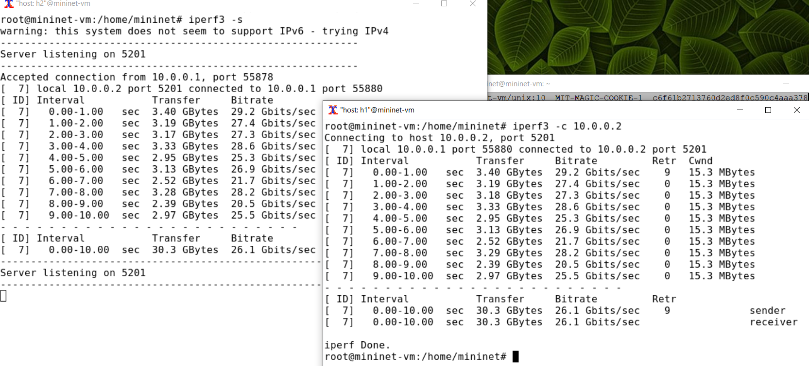{ #fig:010 width=70% height=70% }

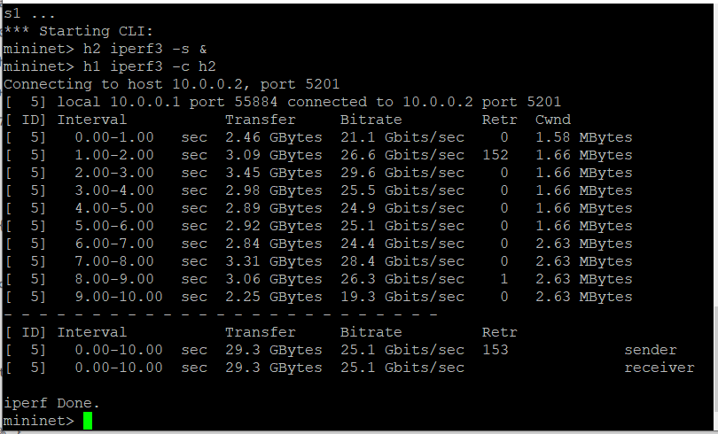{ #fig:011 width=70% height=70% }

6. Провёл другой тест и визуализировал данные 

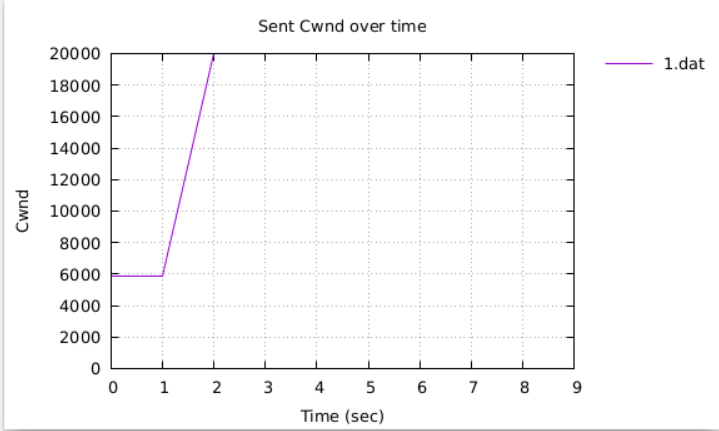{ #fig:012 width=70% height=70% }

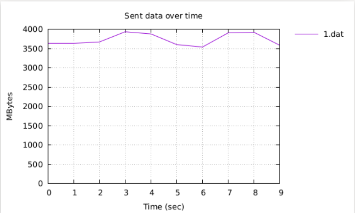{ #fig:013 width=70% height=70% }

