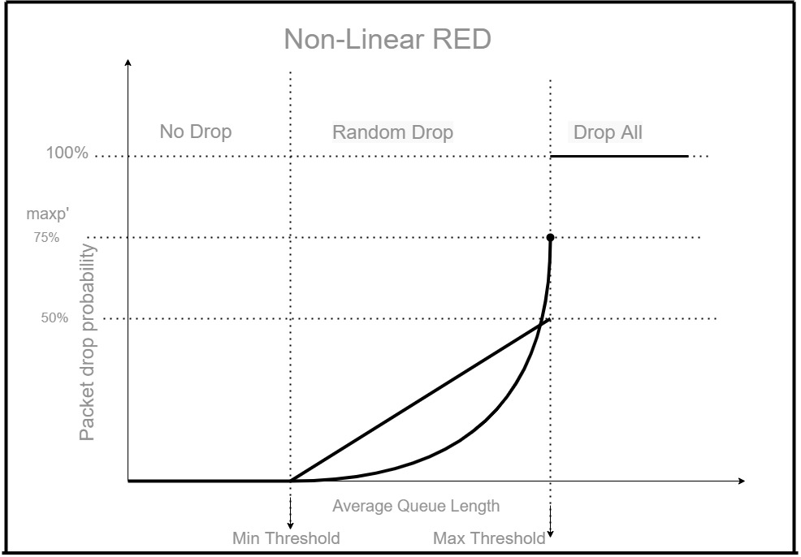

---
## Front matter
title: "Отчёт по практической работе"
author: "Саргсян Арам Грачьяевич"

## Generic otions
lang: ru-RU
toc-title: "Содержание"

## Bibliography
bibliography: bib/cite.bib
csl: pandoc/csl/gost-r-7-0-5-2008-numeric.csl

## Pdf output format
toc: true # Table of contents
toc-depth: 2
<!--lof: true # List of figureslot: true # List of tables -->
fontsize: 12pt
linestretch: 1.5
papersize: a4
documentclass: scrreprt
## I18n polyglossia
polyglossia-lang:
  name: russian
  options:
	- spelling=modern
	- babelshorthands=true
polyglossia-otherlangs:
  name: english
## I18n babel
babel-lang: russian
babel-otherlangs: english
## Fonts
mainfont: PT Serif
romanfont: PT Serif
sansfont: PT Sans
monofont: PT Mono
mainfontoptions: Ligatures=TeX
romanfontoptions: Ligatures=TeX
sansfontoptions: Ligatures=TeX,Scale=MatchLowercase
monofontoptions: Scale=MatchLowercase,Scale=0.9
## Biblatex
biblatex: true
biblio-style: "gost-numeric"
biblatexoptions:
  - parentracker=true
  - backend=biber
  - hyperref=auto
  - language=auto
  - autolang=other*
  - citestyle=gost-numeric
## Pandoc-crossref LaTeX customization
figureTitle: "Рис."
tableTitle: "Таблица"
listingTitle: "Листинг"
lofTitle: "Список иллюстраций"
lotTitle: "Список таблиц"
lolTitle: "Листинги"
## Misc options
indent: true
header-includes:
  - \usepackage{indentfirst}
  - \usepackage{float} # keep figures where there are in the text
  - \floatplacement{figure}{H} # keep figures where there are in the text
---

# Введение

Согласно программе научной практики направления подготовки 09.03.03 "Прикладная информатика" программы "Прикладная информатика" целями научно-исследовательской работы(получении первичных навыков научно-исследовательской работы) являются:

- формирование навыков использования современных научных методов для решения научных и практических задач;
- формирование универсальных и профессиональных компетенций в соответствии с ОС ВО РУДН;
- формирование навыков проведения исследовательской работы и работы с источниками данных;
- знакомство с принципами функционирования и изучение методов разработки и анализа моделей функционирования сложных систем, их фрагментов и отдельных элементов;
- применение методов для анализа и расчёта показателей функционирования сложных систем, их фрагментов и отдельных элементов.

Также опредены задачи практики:

- изучение специфики функционирования и соответствующих  методов анализа сложных систем;
- формирование навыков решения конкретных научно-практических задач самостоятельно или в научном коллективе; 
- формирование навыков проведения исследовательской работы и получении научных и прикладных результатов;
- изучение принципов и методов построения моделей сложных систем (в том числе технических систем, сетей и систем телекоммуникаций);
- изучение принципов и методов анализа поведения параметров моделей сложных систем (в том числе программных и технических систем, сетей и систем телекоммуникаций, и т. п.);
- приобретение практических навыков в области изучения научной литературы и (или) научно-исследовательских проектов в соответсвии с будущим    профилем профессиональной.

Для достижении вышеупомянутых целей и задач в рамках учебной практики по теме "Моделирования алгоритма управления очередями RED в средстве моделирования NS-2" мною было выполнено следующее:

- рассмотрены основные методы имитационного, аналитического и натурного моделирования сетей;
- исследована специфика моделирования различных сетей c помощью программы NS-2;
- проведен сравнительный анализ результатов имитационнойого моделирования сети(графики размера TCP-окна, длины очереди и средней взвешанной очереди) при различных модификациях алгоритма RED, разных пороговых значений и видов TCP-окна. 
 

# Основные методы моделирования сетей

## NS-2

NS-2(Network simaulator 2) — это программное средство моделирования сетей, использующиеся для исследования и анализа поведения компьютерных сетей. Запуск симуляции в данной среде позволяет анализировать различные протоколы и алгоритмы сетевой связи. NS-2 разработан на языке программирования С++ и TCL, что обеспечивает гибкость и расширяемость средства моделирования. NS-2 содержит библиотеку классов, представляют различные элементы сети, такие как узлы, маршрутизаторы, каналы связи и протоколы передачы данных. Для создания модели сети определяются характеристики и параметры каждого элемента сети: пропускная способность каналов, задержки, вероятность потери пакетов и другие. После завершения симуляции NS-2 предоставляет мощные инструменты анализа результатов, включая возможность визуализации данных посредством программы NAM(Network animator), статический анализ и сравнение экспериментов, что позволяет изучать и оценивать производительность различных протоколов и алгоритмов в различных сценариях сети.

## Mininet

Mininet — это симулятор сетевых топологий на основе виртуаилизации, который позволяет моделировать и изучать поведение сетей в контролируемой среде, основанный на использовании виртуальных машин и пространств имен Linux для создания изолированных сетевых узлов. Моделирование сетевых топологией с помощью Mininet позволяет исследовать различные сетевые протоколые, маршрутизацию, управление трафиком и т. д. Возможности моделирования с помощью Mininet включают создание виртуальных сетевых узлов, конфигурирование топологий(связь между узлами, настраивать IP-адреса, маршрутизацию), имитировать различные условия сети, такие как задержки, потери пакетов и пропускную способность, интеграция с контроллерами для исследования новых протоколов и алгоритмов.

## Cisco Packet Tracer

Packet Tracer — это программное средство, предоставляемое компанией Cisco Systems, позволяющей смоделировать, конфигурировать и отлаживать сетевые сценарии, широко используемое в области сетевых технологий. Данное программное обеспечение предоставляет виртуальную среду, которое позволяет создавать сетевые топологии и настраивать устройства Cisco: маршрутизаторы, коммутаторы, и т д. Графический интерфейс позволяет соединять устройства, устанавливать параметры соединений и задавать настройки протоколов. Cisco Packet Tracer позволяет имитировать передачу данных в сети. Пользователи могут выполнять различные тесты связи, проводить диагностику и мониторинг сетевых устройств, а также создавать и анализировать журналы событий.

## GNS-3

GNS-3 — это программное средство моделирования сетей, позволяющий создавать виртуальные сети, состоящие из реальных или виртуальных устройств, и анализировать их поведение. GNS-3 разработан на языке программирования Python и основан на эмуляторе динамических узлов Dynamips, который позволяет запускать реальные образы операционных систем. В отличие от Packet Tracer, GNS-3 позволяет смоделировать не только устройства Cisco, но и другие устройства, как Juniper, Palo Alto и другие, что позволяет смоделировать различные типы сетей, включая центры обработки данных и облачные инфраструктуры. Одной из главных особенностей GNS-3 является интеграция с виртуальными машинами, что расширяет возможности моделирования. Появляется возможность создавать сетевые сценарии, в которых виртуальные машины выполняют реальные функции, такие как серверы, клиенты, точки доступа Wi-Fi и т. д. Это позволяет проводить натурное моделирование и получить более реалистичные результаты в рамках виртуальной среды.

# RED

## Сlassic RED

RED(Random early detection) — механизм предотвращения перегрузки на шлюзе. Он основан на общих принципах, очень полезен для управления средним размером очереди в сети, где не доверяют взаимодействию протокола передачи. В отличие от Droptail, который работает таким образом, что когда очередь заполняется, новые пакеты, поступающие в очередь, начинают теряться, алгоритм RED учитывает потоки трафика в сети и стремится предоставить равную пропускную способность для каждого соединения, что позволяет избежать перегрузки сети и улучшить качество обслуживания. В оригинальном RED, маршрутизатор вычисляет усредненный по времени средний размер очереди с использованием фильтра нижних частот (экспоненциально взвешенное скользящее среднее) или сглаживания по длине выборки очередей, средний размер очереди сравнивается с двумя пороговыми значениями: минимальным порогом и максимальным. Когда средний размер очереди меньше минимального порога, пакеты не отбрасываются, когда средний размер очереди превышает максимальный порог, отбрасывается все поступающие пакеты. Если размер средней очереди находится между минимальным и максимальным порогом, пакеты отбрасываются с вероятностью p, которая линейно увеличивается до тех пор, пока средняя очередь не достигнет максимального порога.
 
Вероятность $p_{b}$ маркировки на отбрасывание пакетов представляет собой функцию, линейно зависящую от $\hat{q}$, минимального $q_{min}$ и максимального $q_{max}$ пороговых значений и параметра $p_{max}$, определяющего часть отбрасываемых пакетов при достижении средним размером очереди значения $q_{max}$ и вычисляется следующим образом:

$$
p_{b} = \begin{cases}
	0, &  \ 0 < \hat{q} \leq q_{min}
	\\
	1, &  \ \hat{q} > q_{max}
	\\
	\frac{\hat{q} - q_{min}}{q_{max} - q_{min}} p_{max}, & \ q_{min} < \hat{q} \leqslant q_{max} 
\end{cases}
$$					

График функции вероятности потери пакета в зависимости от среднего размера очереди выглядит следующим образом(@fig:001):

{#fig:001 width=70%}  

В NS-2 файлы, связанные с RED, прописаны в каталоге ns-2.35/queue, там представлены также другие реализации очередей (среди них DropTail, BLUE и т.д.). Следует уделить внимание двум файлам: red.cc(исходники), и red.h(заголовочный файл). Вероятность отбрасывания пакета прописана в функции double REDQueue::calculate_p_ne файла red.cc. 

```
double
REDQueue::calculate_p_new(double v_ave, double th_max, int gentle, double v_a, 
	double v_b, double v_c, double v_d, double max_p)
{
	double p;
	if (gentle && v_ave >= th_max) { //для модификации GRED
		p = v_c * v_ave + v_d;
        } else if (!gentle && v_ave >= th_max) { // Превысили пороговое значение в классическом RED
                p = 1.0;
        } else { //p в промежутке от 0 до max_p, тогда средний размер очереди в промежутке th_min до th_max
                p = v_a * v_ave + v_b;
                // p = (v_ave - th_min) / (th_max - th_min)
                p *= max_p; 
        }
	if (p > 1.0)и //пакеты отбрасываюся
		p = 1.0;
	return p;
}
```

## GRED 

GRED (Gentle random early detection - мягкое/аккуратное произвольное раннее обнаружение) — алгоритм активного управления очередью, является расширением RED.Стандартный алгоритм увеличивает вероятность отбрасывания с 0.05 до 0.5, когда средняя длина очереди увеличивается от минимального до максимального порогового значения, но при превышении максимального порога вероятность возрастает напрямую с 0.5 до 1. Этот внезапный скачок нормализуется модификацией Gentle RED, который расширяет RED тем, что добавляет дополнительное максимальное пороговое значние, которое равно $2q_{max}$,  тем самым "сглаживая" кривую. Для реализации модификации в NS-2 при описании очереди нужно задать переменной gentle_ true. 

Вычисляется следующим образом:

$$
p_{b} =\begin{cases}
	0, &  \  0 < \hat{q} \leq q_{min} 
	\\
	\frac{\hat{q} - q_{min}}{q_{max} - q_{min}} p_{max}, & \ q_{min} \leqslant \hat{q} < q_{max} 
	\\
	\frac{\hat{q} - q_{min}}{q_{max}}(1-p_{max}) - p_{max}, & \ q_{max} \leqslant \hat{q} < 2q_{max} 
	\\
	1, &  \ \hat{q} \geqslant  q_{max} 
\end{cases}
$$

График функции вероятности потери пакета в зависимости от среднего размера очереди выглядит следующим образом(@fig:002):

{#fig:002 width=70%}

## NLRED

Nonlinear RED — это модификация классического алгоритма RED, в отличие от которого использует нелинейную функцию для определения вероятности отбрасывания пакетов, что позволяет более гибко регулировать процесс управления перегрузками, учитывая различные характеристики трафика и динамику сети. Вероятность $p_{b}$ маркировки на отбрасывание пакетов вычисляется следующим способом:   

$$
p_{b} = \begin{cases}
	0, &  \ 0 < \hat{q} \leq q_{min}
	\\
	1, &  \ \hat{q} > q_{max}
	\\
	\frac{\hat{q} - q_{min}}{q_{max} - q_{min}} {1.5p_{max}}^2, & \ q_{min} < \hat{q} \leqslant q_{max} 
\end{cases}
$$

График функции вероятности потери пакета в зависимости от среднего размера очереди выглядит следующим образом(@fig:003):

{#fig:003 width=70%}

По умолчанию NLRED не реализована в NS-2. Для её добавления я проделал следующие шаги:

1. Установил к себе на машину патч NLRED.patch от Mohit P. Tahiliani для версии 2.34, совместимой также для версии 2.35.
2. Отредактировал файл, заменим везде номер версии на 2.35 и переместил в каталог ns-allinone.
3. В терминале запустил команду patch -p1 < NLRED.patch, а затем запустил ./install.
4. В настройке очереди сети указал значение переменной nonlinear_ 1.
 
## ARED и RARED

В алгоритме Adaptive RED (ARED) функция сброса модифицируется посредством изменения по принципу AIMD, заключающейся в том, что увеличение некоторой величины производится путём сложения с некоторым параметром, у уменьшение — путём умножения на параметр.)

Алгоритм ARED функционирует следующим образом. Для каждого интервала interval (параметр) в секундах, если $\hat{q}$  больше целевой (желаемой) $\hat{q_t}$ и $p_{max} \leqslant 0,5$, то $p_{max}$  увеличивается на некоторую величину $\alpha$; в противном случае, если $\hat{q}$ меньше целевой $\hat{q_t}$ и $p_{max}\geqslant0,01$, то $p_{max}$  уменьшается в $\beta$ раз:

$$
p_{max} = \left\{ \begin{array}{c}
p_{max}+\alpha, \ \hat{q}>\hat{q_{t}}, \ p_{max} \leqslant0,5 \\
\beta * p_{max}, \ \hat{q}<\hat{q_{t}}, \ p_{max} \geqslant0,01 \\
\end{array} \right.
$$

где

$$
q_{min}+0,4(q_{max}-q_{min}) < \hat{q_t} < q_{min}+0,6(q_{max}-q_{min})
$$

Основные особенности: 

 - автоматическая установка минимального порога ($q_{min}$). Он устанавливается в зависимости от пропускной способности канала (C) и задержки целевой очереди;
 - автоматическая установка максимального порога ($q_{max}$). Он устанавливается в зависимости от значения месяца;
 - автоматическая настройка wq. Он устанавливается в зависимости от пропускной способности канала (C);
 - адаптивная настройка $p_{max}$. Он адаптирован в соответствии с текущей средней длиной очереди.

Алгоритм Refined ARED (RARED) является модификацией ARED и предлагает более активно изменять вероятность сброса $p_max$, чтобы иметь возможность быстрой адаптации к изменяющейся экспоненциально взвешенной скользящей средней длине очереди $\hat{q}$:

$$
p_{b} = \left\{ \begin{array}{cl}
p_{max}+\alpha, \  \hat{q}>\hat{q_{t}}, \ p_{max} \leqslant0,5 \\
\beta p_{max}, \ \hat{q}\leqslant\hat{q_{t}}, \ p_{max} \geqslant0,5\\
\end{array} \right.
$$

где 

$$
q_{min}+0,48(q_{max}-q_{min}) < \hat{q_t} < q_{min}+0,52(q_{max}-q_{min})
$$
$$
\alpha=(0,25\frac{\hat{q}-\hat{q_t}}{\hat{q_t}})p_{max}, \ \beta=1-(0,17\frac{\hat{q}-\hat{q_t}}{\hat{q_t}-q_{min}})
$$

По умолчанию ARED и REARED не реализовани в NS-2. Для их добавления я проделал следующие шаги:

1. Установил к себе на машину патч Re-ARED.patch от Mohit P. Tahiliani для версии 2.34, совместимой также для версии 2.35.
2. Отредактировал файл, заменим везде номер версии на 2.35 и переместил в каталог ns-allinone.
3. В терминале запустил команду patch -p1 < Re_ARED.patch, а затем запустил ./install.
4. В настройке очереди сети указал значение переменной adaptive_ 1 и для RARED дополнительно refined_adaptive_ 1.

# Результаты

Мною был написана программа, реализующая имитационную модель сети со следующей топологией:

- $N=20$ TCP-источников, N TCP-приёмников, двух маршрутизаторов R1 и R2 между источниками и приёмниками (N — не менее 20);
- между TCP-источниками и первым маршрутизатором установлены дуплексные соединения с пропускной способностью 100 Мбит/с и задержкой 20 мс очередью типа DropTail;
- между TCP-приёмниками и вторым маршрутизатором установлены дуплексные соединения с пропускной способностью 100 Мбит/с и задержкой 20 мс очередью типа DropTail;
- между маршрутизаторами установлено симплексное соединение (R1–R2) с пропускной способностью 20 Мбит/с и задержкой 15 мс очередью типа RED,
размером буфера 300 пакетов; в обратную сторону — симплексное соединение (R2–R1) с пропускной способностью 15 Мбит/с и задержкой 20 мс очередью типа DropTail;
- данные передаются по протоколу FTP поверх TCPReno;
- параметры алгоритма RED: $q_{min}=75, q_{max}=150, q_w=0, 002, p_{max}=0.1$;
- максимальный размер TCP-окна 32; размер передаваемого пакета 500 байт; время моделирования — не менее 20 единиц модельного времени.

Полная реализация программы приведена в разделе  **Приложения**,  для вывода графиков была использована программа GNUPLOT.

Смоделировав сеть с указанными параметрами и запустив gnuplot скрипт, я получил следующий график(@fig:004).

{#fig:004 width=70%}

Как мы видим из первого графика, в момент времени  $t=1 c$ достигается максимальные длины очереди 140000 пакетов и средней длины очереди 120000 пакетов, а при дальнейшем моделировании длина очереди варьируются от 0 до 70000 пакетов, а средняя очередь от 0 до 60000. 


Для выявления влияния пороговых значений на длину очереди смоделировал сеть и вывел в одном графике длины средней очереди при разных пороговых значений, и при одинаковых остальных параметров (@fig:005).

{#fig:005 width=70%}

Как видно из графика, уменьшение увелечение диапазона между $q_{min}$ и $q_{max}$ способствует увелечению длины очереди на линке.


Для сравнений различных модификаций смоделировали сеть, задав в качестве очереди RED, GRED, NLRED (@fig:006, @fig:007).

{#fig:006  width=70%}

{#fig:007  width=70%}

Различие между RARED с остальными модификациями легко объяснять его автоматическим выбором минимального и максимального пороговых величин.


Смоделировали сеть при разных TCP(Reno, Vegas и Newreno)(@fig:008, @fig:009, @fig:010).

{#fig:008  width=70%}

{#fig:009 width=70%}

{#fig:010 width=70%}

Такое заметное отличие TCP/Vegas от TCP/Reno и TCP/Newreno объяснется тем, что он использует альтернативный подход к управлению очередьями. Вместо использования потери пакетов в качестве индикатора перегрузки сети, вместо этого он анализирует задержку пакетов в сети и использует данную информацию для определения, происходит ли перегрузка сети.


# Заключение

За период практики в отделе информационно-технологического обеспечения естественно-научных факультетов УИТО и СТС, были достигнуты все цели и решены все задачи, определенные в программе научной практики направления подготовки 09.03.03 "Прикладная информатика" программы "Прикладная информатика"(см. введение отчёта по практике).

В процессе прохождения практики я работал с научной терминологией области исследований; научился собирать и обрабатывать данные научных, необходимых для формирования соответствующих выводов исследований; осуществлять целенаправленный поиск информации на русском и английском языках о новейших научных достижений в Интернете и  из других источников; строить и анализировать имитационные модели обьекта исследований.

В результате прохождения данной практики я приобрел следующие практические навыки, умения, универсальные и профессиональные компетенции:

- способность управлять проектом на всех этапах его жизненного цикла(постановка задачи, планирование, реализация);
- способность составлять естесвенно-научные отчеты с IMRAD структурой(Введение, Методы и материалы, Результаты и Дискусия);
- способность разрабатывать имитационные модели и проводить их анализ при решении задач в области (составлена имитационная модель сети с алгоритмом управления очередью между маршрутизаторами типа RED);
- способность профессиональной деятельностиобность проведения работ по обработке и анализу научно-технической информации и результатов исследований(изучение необходимой литературы по теме исследования на русском и английском языках, подготовка литературного обзора по теме исследований); 
 
Таким образом, в рамках практики я рассмотрел моделирование модуля RED c помощью программного средства NS-2 версии 2.35. Также представлена программная реализация имитационной модели сети модулем RED и проведен сравнительный анализ результатов при моделировании сети с разными входными параметрами, модификаций RED и типов TCP окна.


# Список литературы {.unnumbered}

1. Sally Floyd and Van Jacobson Random Early Detection Gateways for Congestion Avoidance, 1993 год
2. J. Roberts Modeling random early detection in a differentiated services network, 2002 год
3. Kevin Fall, Kannan VaradhanThe ns Manual, 2011 год
4. Королькова А. В., Кулябов Д. С., Черноиванов А. И. К вопросу о классификации алгоритмов RED // Вестник РУДН, серия «‎Математика. Информатика. Физика».–2009.–№ 3,–стр. 34-46
5. Mohit P. Tahiliani, Nonlinear RED patch for NS-2.–2012
6. Mohit P. Tahiliani, Refined Adaptive RED (Re-ARED or RARED) patch for NS-2.–2012


# Приложения {.unnumbered}

**Имитационная модель сети**

- main.tcl
```
#Создать новый экземпляр объекта Symulator
set ns [new Simulator]
#Открыть трейс файл для nam
set nf [open output/out.nam w]
$ns namtrace-all $nf
set N 20
source "nodes.tcl"
source "links.tcl"
source "queue.tcl"
source "connections.tcl"
source "timing.tcl"
source "nam.tcl"
source "finish.tcl"                                                                                      
#Запуск программы
$ns run
```
- nodes.tcl
```
set node_(r0) [$ns node]
set node_(r1) [$ns node]

for {set i 0} {$i < $N} {incr i} {
	set node_(s$i) [$ns node]
	set node_(s[expr $N + $i]) [$ns node]
	}
```
- links.tcl
```
for {set i 0} {$i < $N} {incr i} {
	$ns duplex-link $node_(s$i) $node_(r0) 100Mb 20ms DropTail
	$ns duplex-link $node_(s[expr $N + $i]) $node_(r1) 100Mb 20ms DropTail
}

$ns simplex-link $node_(r0) $node_(r1) 20Mb 15ms RED
$ns simplex-link $node_(r1) $node_(r0) 15Mb 20ms DropTail
```
- nam.tcl
```
$node_(r0) color "red"
$node_(r1) color "red"
$node_(r0) label "RED"
$node_(r1) shape "square"
$node_(r0) label "square"

$ns simplex-link-op $node_(r0) $node_(r1) orient right
$ns simplex-link-op $node_(r1) $node_(r0) orient left
$ns simplex-link-op $node_(r0) $node_(r1) queuePos 0
$ns simplex-link-op $node_(r1) $node_(r0) queuePos 0

for {set m 0} {$m < $N} {incr m} {
	$ns duplex-link-op $node_(s$m) $node_(r0) orient right
	$ns duplex-link-op $node_(s[expr $N + $m]) $node_(r1) orient left 
}
for {set i 0} {$i < $N} {incr i} {
	$node_(s$i) color "blue"
	$node_(s$i) label "ftp"
}
```
- connections.tcl
```
for {set t 0} {$t < $N} {incr t} {
	$ns color $t green
	set tcp($t) [$ns create-connection TCP/Reno $node_(s$t) TCPSink $node_(s[expr $N + $t]) $t]
	$tcp($t) set window_ 32
	$tcp($t) set maxcwnd_ 32
	set ftp($t) [$tcp($t) attach-source FTP]
}

proc plotWindow {tcpSource file} {
   global ns
   set time 0.01
   set now [$ns now]
   set cwnd [$tcpSource set cwnd_]
   puts $file "$now $cwnd"
   $ns at [expr $now+$time] "plotWindow $tcpSource $file"
}
```
- queue.tcl
```
$ns queue-limit $node_(r0) $node_(r1) 300
$ns queue-limit $node_(r1) $node_(r0) 300

set windowVsTime [open output/WvsT w]
set qmon [$ns monitor-queue $node_(r0) $node_(r1) [open output/qm.out w]]
[$ns link $node_(r0) $node_(r1)] queue-sample-timeout

set redq [[$ns link $node_(r0) $node_(r1)] queue]
$redq set thresh_ 75 #q_min
$redq set maxthresh_ 150  #q_max
$redq set q_weight_ 0.002 # q_weight
$redq set linterm_ 10 # 1/p_max
$redq set drop-tail_ true
$redq set queue-in-bytes false #очередь в паетах
$redq set mean_pktsize_ 500
set tchan_ [open output/all.q w]
$redq trace curq_
$redq trace ave_
$redq attach $tchan_
```
- timing.tcl
```
for {set r 0} {$r < $N} {incr r} {
	$ns at 0.0 "$ftp($r) start"
	$ns at 1.0 "plotWindow $tcp($r) $windowVsTime"
	$ns at 24.0 "$ftp($r) stop"
}

$ns at 25.0 "finish"
```
- finish.tcl
```
#Finish procedure
proc finish {} {
   global ns nf
   $ns flush-trace
   close $nf
   global tchan_
   set awkCode {  
      {#запись данных в файлы очереди и средней очереди
	 if ($1 == "Q" && NF>2) {
	    print $2, $3 >> "output/temp.q";
	    set end $2
	 }
	 else if ($1 == "a" && NF>2)
	 print $2, $3 >> "output/temp.a";
      }
   }

   set f [open output/temp.queue w]
   puts $f "TitleText: RED"
   puts $f "Device: Postscript"

   if { [info exists tchan_] } {
      close $tchan_
   }
   #обновление данных
   exec rm -f output/temp.q output/temp.a
   exec touch output/temp.a output/temp.q

   exec awk $awkCode output/all.q

   puts $f \"queue
   exec cat output/temp.q >@ $f
   puts $f \n\"ave_queue
   exec cat output/temp.a >@ $f
   close $f
   # вывод в xgraph
   exec xgraph -bb -tk -x time -t "TCPRenoCWND" output/WvsT &
   exec xgraph -bb -tk -x time -y queue output/temp.queue &
   exit 0
}
```

