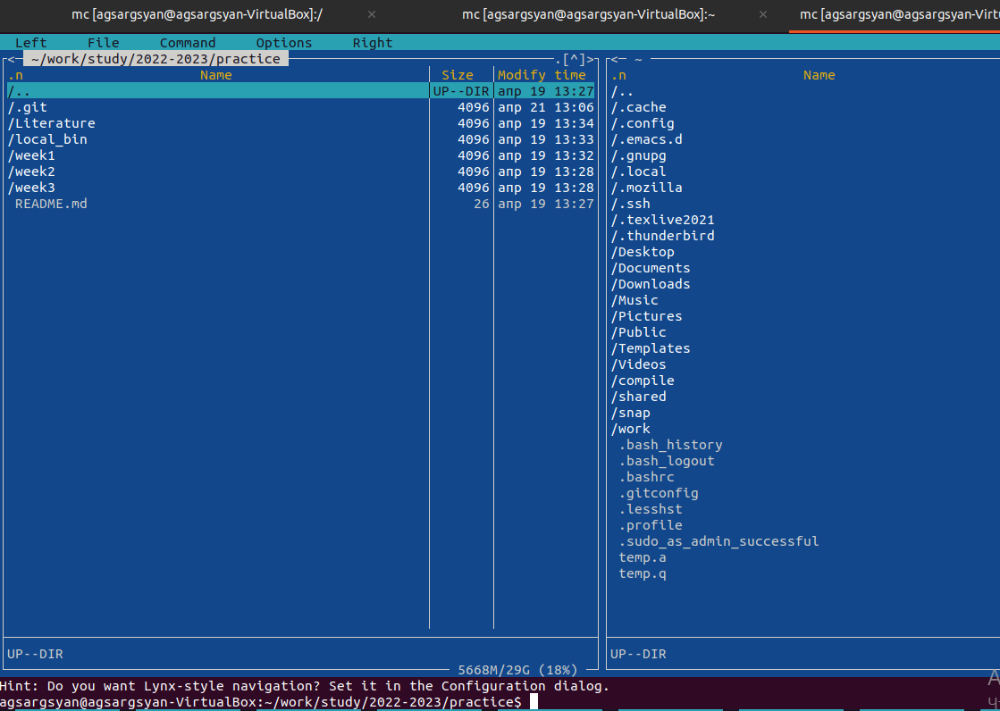
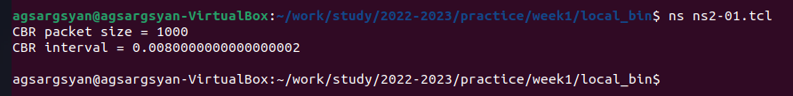
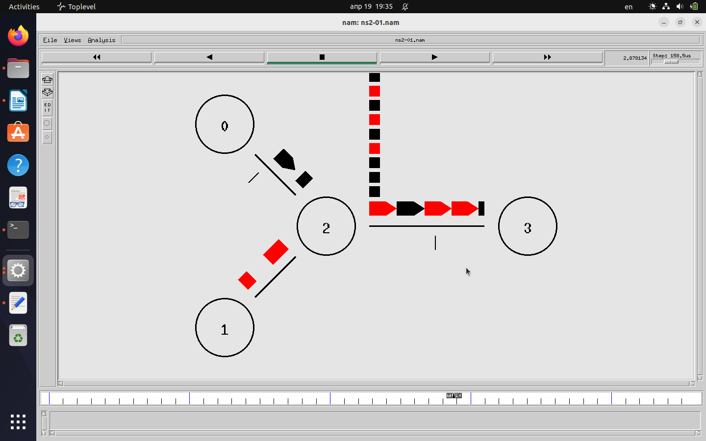

---
## Front matter
title: "Отчёт по практической работе"
subtitle: "Первая неделя"
author: "Саргсян Арам Грачьяевич"

## Generic otions
lang: ru-RU
toc-title: "Содержание"

## Bibliography
bibliography: bib/cite.bib
csl: pandoc/csl/gost-r-7-0-5-2008-numeric.csl

## Pdf output format
toc: true # Table of contents
toc-depth: 2
lof: true # List of figures
lot: true # List of tables
fontsize: 12pt
linestretch: 1.5
papersize: a4
documentclass: scrreprt
## I18n polyglossia
polyglossia-lang:
  name: russian
  options:
	- spelling=modern
	- babelshorthands=true
polyglossia-otherlangs:
  name: english
## I18n babel
babel-lang: russian
babel-otherlangs: english
## Fonts
mainfont: PT Serif
romanfont: PT Serif
sansfont: PT Sans
monofont: PT Mono
mainfontoptions: Ligatures=TeX
romanfontoptions: Ligatures=TeX
sansfontoptions: Ligatures=TeX,Scale=MatchLowercase
monofontoptions: Scale=MatchLowercase,Scale=0.9
## Biblatex
biblatex: true
biblio-style: "gost-numeric"
biblatexoptions:
  - parentracker=true
  - backend=biber
  - hyperref=auto
  - language=auto
  - autolang=other*
  - citestyle=gost-numeric
## Pandoc-crossref LaTeX customization
figureTitle: "Рис."
tableTitle: "Таблица"
listingTitle: "Листинг"
lofTitle: "Список иллюстраций"
lotTitle: "Список таблиц"
lolTitle: "Листинги"
## Misc options
indent: true
header-includes:
  - \usepackage{indentfirst}
  - \usepackage{float} # keep figures where there are in the text
  - \floatplacement{figure}{H} # keep figures where there are in the text
---

# Цель работы

Изучить средство моделирования NS2, установить все необходимые утилиты для работы с ней, запустить первую тестовую программу.

# Задание

- Установить к себе на устройство виртуальную машину Ubuntu 22.04
- Установить на ней утилиты NS2, GNUPLOT, git, mc, make, emacs
- Изучить теоритическую информацию об NS2 и основны синтаксиса otcl
- Смоделировать тестовую модель по заданной топологии
- Синхронизировать всё с репозиторием в github

# Теоретическое введение

NS-2 (Network Simulator 2) - это средство моделирования сетевых протоколов, которое широко используется для исследований и анализа производительности различных сетевых архитектур и протоколов, является программным обеспечением с открытым исходным кодом. NS-2 позволяет моделировать различные типы сетевых топологий и протоколов передачи данных, включая проводные и беспроводные сети, маршрутизацию, управление трафиком и т.д. Кроме того, NS-2 имеет расширяемую архитектуру, позволяющую создавать пользовательские модули для расширения функциональности средства. 

NS-2 является мощным инструментом для исследований и анализа производительности сетевых протоколов и алгоритмов. Он позволяет смоделировать различные сценарии использования сетей и проанализировать их производительность в различных условиях. NS-2 также позволяет проводить эксперименты с реальными устройствами и сетями, которые могут быть трудными для организации в реальной жизни. NS-2 имеет свой язык описания сценариев TCL (Tool Command Language), который используется для создания сценариев моделирования. TCL-скрипты определяют топологию сети, настройки устройств, протоколы и другие параметры, которые затем используются для моделирования сценариев.

В табл. @tbl:std-dir приведено сравнение NS-2 с аналогичными программами.

: Описание некоторых программ для моделирования сетей {#tbl:std-dir}

| Название программы | Лицензия | Язык программирования | Совместимость | Примечание |
|--------------------|----------|------------------------|-----------------|------------------------------------------------------------------------|
| NS-2  |Open source | C++/otcl | Linux, Windows, Mac| Базовая визуализация и большую базу пользователей и библиотек для моделирования различных протоколов и алгоритмов |
| NS-3  | Open source| C++ | Linux, Windows, Mac | Более современная архитектура и расширенные возможности для моделирования беспроводных сетей и IPv6, чем NS2 |
|OPNET |  Eclipse Public License | C++/Java | Windows, Linux | Расширенные возможности для моделирования беспроводных сетей, в том числе сенсорных сетей и промышленных беспроводных сетей |   
|OMNET++ | Open source | C++/NED | Linux, Windows, Mac | Расширенные возможности моделирования беспроводных сетей и более современные инструменты визуализации, чем NS2 |                                                                             

# Выполнение лабораторной работы

1. Подготовил рабочее пространство, установив виртуаульную машину со всеми утилитами(NS-2, GNUPLOT, Pandoc, git, make, mc, emacs, Python), 
настроил общую папку между основной и гостевой ОС (рис. @fig:001).

 {#fig:001 width=70%}

2. Синхронизировал её с репозиторием в github
 [https://github.com/agsargsyan/study_2022-2023_practice](https://github.com/agsargsyan/study_2022-2023_practice)

3. Изучил заданную топологию сети (рис. @fig:002).

{#fig:002 width=70%}

4. Написал первую тестовую программу для моделирования заданной топологии
```
#Создать новый экземпляр объекта Symulator
set ns [new Simulator]

#Задаем разные цвета для потоков
$ns color 1 black
$ns color 2 red

#Открыть трейс-файл для nam
set nf [open ns2-01.nam w]
$ns namtrace-all $nf 

#Finish procedure
proc finish {} {
	global ns nf
	$ns flush-trace
	#Закрыть трейс-файл nam
	close $nf
	exit 0
}

#Create 4 nodes
set n0 [$ns node]
set n1 [$ns node]
set n2 [$ns node]
set n3 [$ns node]

#Create links into nodes
$ns duplex-link $n0 $n2 2Mb 10ms DropTail
$ns duplex-link $n1 $n2 2Mb 10ms DropTail
$ns duplex-link $n2 $n3 1.7Mb 20ms DropTail

#Установим размер очереди на линке (n2-n3) в 10 пакетов
$ns queue-limit $n2 $n3 10

#Задаём расположение(для nam)
$ns duplex-link-op $n0 $n2 orient right-down
$ns duplex-link-op $n1 $n2 orient right-up
$ns duplex-link-op $n2 $n3 orient right

#Задать монитор очереди(n2-n3) for nam
$ns duplex-link-op $n2 $n3 queuePos 0.5

#Установка TCP-соединение
set tcp [new Agent/TCP]
$tcp set class_ 2
$ns attach-agent $n0 $tcp
set sink [new Agent/TCPSink]
$ns attach-agent $n3 $sink
$ns connect $tcp $sink
$tcp set fid_ 1

#Установим соединение FTP поверх TCP
set ftp [new Application/FTP]
$ftp attach-agent $tcp
$ftp set type_ FTP

#Установим UDP-соединение
set udp [new Agent/UDP]
$ns attach-agent $n1 $udp
set null [new Agent/Null]
$ns attach-agent $n3 $null
$ns connect $udp $null
$udp set fid_ 2

#Установим соединение CBR поверх UDP
set cbr [new Application/Traffic/CBR]
$cbr attach-agent $udp
$cbr set type_ CBR
$cbr set packet_size_ 1000
$cbr set rate_ 1mb
$cbr set random_ false                                                                                          

#Задаём планировщик
$ns at 0.1 "$cbr start"
$ns at 1.0 "$ftp start"
$ns at 4.0 "$ftp stop"
$ns at 4.5 "$cbr stop"

#Отсоединить tcp и sink агенты
$ns at 4.5 "$ns detach-agent $n0 $tcp ; $ns detach-agent $n3 $sink"

#Вызвать finish на 5 секунде
$ns at 5.0 "finish"

#Напечатать размер пакета CBR и интервал
puts "CBR packet size = [$cbr set packet_size_]"
puts "CBR interval = [$cbr set interval_]"

#Запуск программы
$ns run
```
5. Вывел размер пакета CBR и интервал (рис. @fig:003).

 {#fig:003 width=70%}

6. Посмотрел симуляцию данной программы в nam (рис. @fig:004).

 {#fig:004 width=70%}

# Выводы

Я изучил основы работы с программой NS-2 для моделирования сетей, подготовил рабочее пространство и запустил первую модель для работы.

# Список литературы

1. The ns Manual Kevin Fall, Kannan Varadhan, 2011 год 

