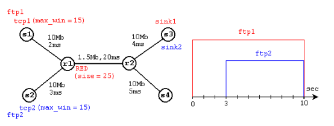
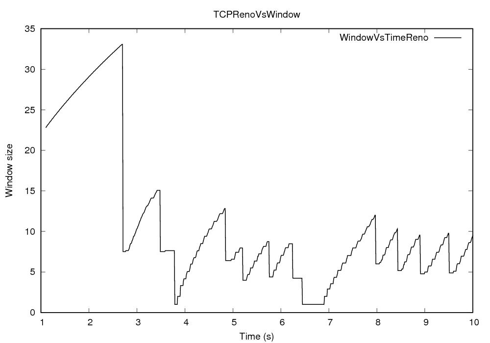
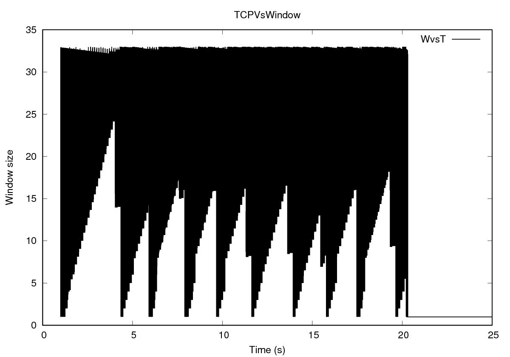
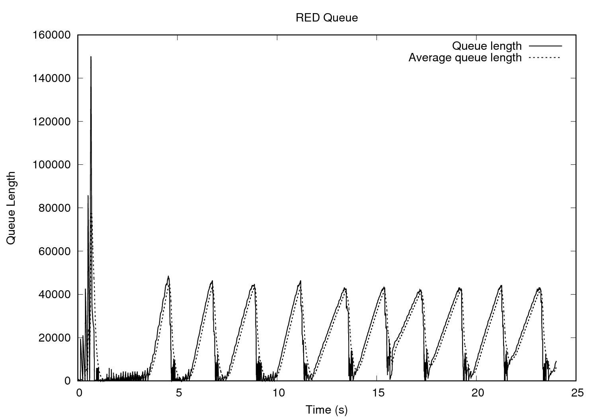

---
## Front matter
title: "Отчёт по лабораторной работе"
author: "Саргсян Арам Грачьяевич"

## Generic otions
lang: ru-RU
toc-title: "Содержание"

## Bibliography
bibliography: bib/cite.bib
csl: pandoc/csl/gost-r-7-0-5-2008-numeric.csl

## Pdf output format
toc: true # Table of contents
toc-depth: 2
<!-- lof: true # List of figures lot: true # List of tables -->
fontsize: 12pt
linestretch: 1.5
papersize: a4
documentclass: scrreprt
## I18n polyglossia
polyglossia-lang:
  name: russian
  options:
	- spelling=modern
	- babelshorthands=true
polyglossia-otherlangs:
  name: english
## I18n babel
babel-lang: russian
babel-otherlangs: english
## Fonts
mainfont: PT Serif
romanfont: PT Serif
sansfont: PT Sans
monofont: PT Mono
mainfontoptions: Ligatures=TeX
romanfontoptions: Ligatures=TeX
sansfontoptions: Ligatures=TeX,Scale=MatchLowercase
monofontoptions: Scale=MatchLowercase,Scale=0.9
## Biblatex
biblatex: true
biblio-style: "gost-numeric"
biblatexoptions:
  - parentracker=true
  - backend=biber
  - hyperref=auto
  - language=auto
  - autolang=other*
  - citestyle=gost-numeric
## Pandoc-crossref LaTeX customization
figureTitle: "Рис."
tableTitle: "Таблица"
listingTitle: "Листинг"
lofTitle: "Список иллюстраций"
lotTitle: "Список таблиц"
lolTitle: "Листинги"
## Misc options
indent: true
header-includes:
  - \usepackage{indentfirst}
  - \usepackage{float} # keep figures where there are in the text
  - \floatplacement{figure}{H} # keep figures where there are in the text
---

# Введение

В высокоскоростных сетях с подключениями с большой полосой пропускания с задержкой, шлюзы в большинстве случаев будут спроектированы с соответственно большими максимальными очередями, чтобы справиться с кратковременной перегрузкой. Транспортный протокол TCP обнаруживает перегрузку только после того, как пакет был отброшен на шлюзе. Однако было бы не желательно иметь большие очереди (возможно, на уровне задержки пропускной способности), которые были бы заполнены большую часть времени; это значительно увеличило бы среднюю задержку в сети. Поэтому с увеличением скорости сетей все важнее иметь механизмы, позволяющие сохранять высокую пропускную способность при низком среднем размере очереди.

В отсутствие явной обратной связи от шлюза было предложено ряд механизмов для транспортных протоколов, которые поддерживают высокую пропускную способность и низкую задержку в сети. Некоторые из этих механизмов предназначены для работы с текущими шлюзами, тогда как другие механизмы связаны с алгоритмами планирования шлюза, которые требуют состояния на соединение в шлюзе. В отсутствие явной обратной связи от шлюза транспортные протоколы могут выводить перегрузку из оцененного времени обслуживания узкого места, изменений пропускной способности, изменений задержки от конца к концу, а также из отбрасывания пакетов или других методов. Тем не менее, представление отдельного соединения ограничено временными масштабами соединения, трафиком соединения, отсутствием знаний о количестве перегруженных шлюзов, возможностями изменения маршрутизации, а также другими трудностями в отличии задержки распространения от постоянной задержки очереди.

Обнаружение перегрузки наиболее эффективно в самом шлюзе. Шлюз может надежно отличать задержку распространения от постоянной задержки в очереди. Шлюз имеет унифицированное представление о поведении очереди с течением времени; перспектива отдельных подключений ограничена шаблонами прибытия пакетов для этих подключений. Также шлюз используется совместно многими активными соединениями с широким диапазоном времени прохождения в оба конца, допусков задержки, требований к пропускной способности и т.д.; решения о продолжительности и величине временной перегрузки, которая должна быть разрешена на шлюзе, лучше всего судить самому шлюзу.

Метод мониторинга среднего размера очереди на шлюзе и уведомления подключений о начинающейся перегрузке основан на том, что по-прежнему будет полезно иметь очереди на шлюзе, в которых трафик от нескольких подключений мультиплицируется вместе с планированием FIFO. Планирование FIFO полезно не только для распределения задержки между соединениями, уменьшая задержку для конкретного соединения в периоды его загруженности, но и хорошо масштабируется и прост в эффективной реализации. В данной работе мы исследуем механизм предотвращения перегрузки на шлюзе RED (Random Early Detection).

# Алгоритм RED

## Описание алгоритма

RED основан на общих принципах, он очень полезен для управления средним размером очереди в сети, где не доверяют взаимодействию протокола передачи. Данная дисциплина управления очередью предназначена для сети, в которой транспортный протокол реагирует на сигналы перегрузки от работы сети. Механизм контроля перегрузки шлюза в RED gateways упрощает работу по контролю перегрузки, необходимую для транспортного протокола и должен быть применим к механизмам контроля перегрузки транспортного уровня, отличным от текущей версии TCP, включая протоколы с управлением потоком на основе скорости, а не размера окна.

В оригинальном RED, маршрутизатор вычисляет усредненный по времени средний размер очереди с использованием фильтра нижних частот (экспоненциально взвешенное скользящее среднее) или сглаживания по длине выборки очередей, средний размер очереди сравнивается с двумя пороговыми значениями: минимальным порогом и максимальным. Когда средний размер очереди меньше минимального порога, пакеты не отбрасываются, когда средний размер очереди превышает максимальный порог, отбрасывается все поступающие пакеты. Если размер средней очереди находится между минимальным и максимальным порогом, пакеты отбрасываются с вероятностью p, которая линейно увеличивается до тех пор, пока средняя очередь не достигнет максимального порога.

## Сравнение с Droptail

Алгоритм Droptail работает таким образом, что когда очередь заполняется, новые пакеты, поступающие в очередь, начинают теряться. Это означает, что все пакеты, которые не могут быть немедленно обработаны, будут отброшены. Droptail прост в реализации и хорошо работает в сетях с низкими требованиями к качеству обслуживания, но не гарантирует никакой пропускной способности для каждого соединения, что может приводить к снижению производительности и задержкам в сети.

RED, с другой стороны, является алгоритмом, который используется для более интеллектуального управления очередью. Он предотвращает переполнение очереди, выбирая случайным образом пакеты для отбрасывания, даже если очередь не заполнена. RED учитывает потоки трафика в сети и стремится предоставить равную пропускную способность для каждого соединения, что позволяет избежать перегрузки сети и улучшить качество обслуживания.

Таким образом, основным отличием между RED и Droptail является то, что RED позволяет контролировать пропускную способность и более эффективно управлять потоками трафика, тогда как Droptail прост в реализации, но не гарантирует равномерное распределение пропускной способности.

# Реализация первой модели

## Описание топологии

Описание моделируемой сети:
- сеть состоит из 6 узлов;
- между всеми узлами установлено дуплексное соединение с различными пропускной способностью и задержкой 10 мс (рис. @fig:001);
- узел r1 использует очередь с дисциплиной RED для накопления пакетов, максимальный размер которой составляет 25;
- TCP-источники на узлах s1 и s2 подключаются к TCP-приёмнику на узле s3;
- генераторы трафика FTP прикреплены к TCP-агентам

{#fig:001 width=70%}

Полная реализация  вычислительной модели сети с алгоритмом управления очередью RED представлена в разделе [**Приложение 1**](https://github.com/agsargsyan/study_2022-2023_practice/edit/main/work/week2/report/report.md#%D0%BF%D1%80%D0%BE%D0%B3%D1%80%D0%B0%D0%BC%D0%BC%D0%B0-%D0%B4%D0%B5%D0%BC%D0%BE%D0%BD%D1%81%D1%82%D1%80%D0%B0%D1%86%D0%B8%D0%B8-%D0%BF%D0%B5%D1%80%D0%B2%D0%BE%D0%B3%D0%BE-%D0%B0%D0%BB%D0%B3%D0%BE%D1%80%D0%B8%D1%82%D0%BC%D0%B0-red).

## Результаты

После запуска программы сгенерировали скрипт для вывода графиков размера окна TCP и длины очереди и средней длины очереди:
```
#!/usr/bin/gnuplot -persist

set terminal postscript eps
set output "images/queues.eps"
set xlabel "Time (s)"
set ylabel "Queue Length"
set title "RED Queue"
plot "output/temp.q" with lines linestyle 1 lt 1 lw 2 title "Queue length", "output/temp.a" with lines linestyle 2 lt 3 lw 2 title "Average queue length"

set terminal postscript eps
set output "images/TCP.eps"
set xlabel "Time (s)"
set ylabel "Window size"
set title "TCPRenoVsWindow"
plot "output/WvsT" with lines linestyle 1 lt 1 lw 2 title "WindowVsTimeReno"
```
В результате запуска программы получил следующие результаты (рис. @fig:002, @fig:003). Следует учитывать, что для моделирования были использованы значения RED в NS-2 по умолчанию, а также алгоритм алгоритм предотвращения перегрузки TCP Reno.

{#fig:002 width=70%}

{#fig:003 width=70%}

# Реализация второй модели

## Описание топологии

- сеть состоит из $N=20$ TCP-источников, N TCP-приёмников, двух маршрутизаторов R1 и R2 между источниками и приёмниками (N — не менее 20);
- между TCP-источниками и первым маршрутизатором установлены дуплексные соединения с пропускной способностью 100 Мбит/с и задержкой 20 мс очередью типа DropTail;
- между TCP-приёмниками и вторым маршрутизатором установлены дуплексные соединения с пропускной способностью 100 Мбит/с и задержкой 20 мс очередью типа DropTail
- между маршрутизаторами установлено симплексное соединение (R1–R2) с пропускной способностью 20 Мбит/с и задержкой 15 мс очередью типа RED,
размером буфера 300 пакетов; в обратную сторону — симплексное соединение (R2–R1) с пропускной способностью 15 Мбит/с и задержкой 20 мс очередью типа DropTail;
- данные передаются по протоколу FTP поверх TCPReno;
- параметры алгоритма RED: $q_{min} = 75, q_{max} = 150, q_w = 0, 002, p_{max} = 0.1$ ;
- максимальный размер TCP-окна 32; размер передаваемого пакета 500 байт; время моделирования — не менее 20 единиц модельного времени.

Полная реализация  вычислительной модели сети с алгоритмом управления очередью RED представлена в разделе [**Приложение 2**](https://github.com/agsargsyan/study_2022-2023_practice/edit/main/work/week2/report/report.md#%D0%BF%D1%80%D0%B8%D0%BB%D0%BE%D0%B6%D0%B5%D0%BD%D0%B8%D0%B5-2). 

В результате запуска программы получил следующие результаты (рис. @fig:004, @fig:005). Для выводов графиков размера окна TCP и длины очереди и средней длины очереди был использовен аналогичный для первой модели скрипт.

{#fig:004 width=70%}

{#fig:005 width=70%}

# Список литературы

1. Sally Floyd and Van Jacobson Random Early Detection Gateways for Congestion Avoidance, 1993 год
2. J. Roberts Modeling random early detection in a differentiated services network, 2002 год
3. Kevin Fall, Kannan VaradhanThe ns Manual, 2011 год

# Приложение 1

## Программа демонстрации первого алгоритма RED

- main.tcl
```
#создаем симулятор
set ns [new Simulator]

#Открыть трейс-файл для nam
set nf [open output/out.nam w]
$ns namtrace-all $nf
#вызываем скрипты со всех файлов
source "node.tcl"
source "link.tcl"
source "connections.tcl"
source "queue.tcl"
source "timing.tcl"
source "nam.tcl"
source "finish.tcl"

$ns run
```
- nam.tcl
```
#Задаем разные цвета для потоков
$ns color 1 Blue
$ns color 0 Red

#отображение в nam
$ns duplex-link-op $node_(s1) $node_(r1) orient right-down
$ns duplex-link-op $node_(s2) $node_(r1) orient right-up
$ns duplex-link-op $node_(r1) $node_(r2) orient right
$ns duplex-link-op $node_(r1) $node_(r2) queuePos 0
$ns duplex-link-op $node_(r2) $node_(r1) queuePos 0
$ns duplex-link-op $node_(s3) $node_(r2) orient left-down
$ns duplex-link-op $node_(s4) $node_(r2) orient left-up
```
- node.tcl
```
#создаем узлы
set node_(s1) [$ns node]
set node_(s2) [$ns node]
set node_(r1) [$ns node]
set node_(r2) [$ns node]
set node_(s3) [$ns node]
set node_(s4) [$ns node]
```
- link.tcl
```
#Создаем линки
$ns duplex-link $node_(s1) $node_(r1) 10Mb 2ms DropTail
$ns duplex-link $node_(s2) $node_(r1) 10Mb 3ms DropTail
$ns duplex-link $node_(r1) $node_(r2) 1.5Mb 20ms RED
$ns queue-limit $node_(r1) $node_(r2) 25
$ns queue-limit $node_(r2) $node_(r1) 25
$ns duplex-link $node_(s3) $node_(r2) 10Mb 4ms DropTail
$ns duplex-link $node_(s4) $node_(r2) 10Mb 5ms DropTail
```
- connections.tcl
```
#Строим соединение
set tcp1 [$ns create-connection TCP/Reno $node_(s1) TCPSink $node_(s3) 0]
$tcp1 set window_ 15
set tcp2 [$ns create-connection TCP/Reno $node_(s2) TCPSink $node_(s3) 1]
$tcp2 set window_ 15
set ftp1 [$tcp1 attach-source FTP]
set ftp2 [$tcp2 attach-source FTP]

#TCP window
set windowVsTime [open output/WvsT w]
set qmon [$ns monitor-queue $node_(r1) $node_(r2) [open output/qm.out w] 0.1];
[$ns link $node_(r1) $node_(r2)] queue-sample-timeout;

proc plotWindow {tcpSource file} {
	global ns
	set time 0.01
	set now [$ns now]
	set cwnd [$tcpSource set cwnd_]
	puts $file "$now $cwnd"
	$ns at [expr $now+$time] "plotWindow $tcpSource $file"
} 
```
- queue.tcl
```
#queue
set redq [[$ns link $node_(r1) $node_(r2)] queue]
set tchan_ [open output/all.q w]
$redq trace curq_
$redq trace ave_
$redq attach $tchan_
```
- timing.tcl
```
#Задаём планировщик
$ns at 0.0 "$ftp1 start"
$ns at 1.1 "plotWindow $tcp1 $windowVsTime"
$ns at 3.0 "$ftp2 start"
$ns at 10 "finish"
```
- finish.tcl
```
#Поставим процедуру "Finish"
proc finish {} {
	global ns nf
	$ns flush-trace
	#Закрыть трейс-файл nam
	close $nf
	global tchan_
	#графики для мгновенной и средневзвешанной экспоненциальной очереди в xgraph
	set awkCode {
	{
		if ($1 == "Q" && NF>2) {
		print $2, $3 >> "output/temp.q";
		set end $2
		}
		else if ($1 == "a" && NF>2)
		print $2, $3 >> "output/temp.a";
	}
	}
	
	set f [open output/temp.queue w]
	puts $f "TitleText: RED"
	puts $f "Device: Postscript"

	if { [info exists tchan_] } {
	close $tchan_
	}
	
	#Удалим предыдущие временные файлы при их наличии
	exec rm -f output/temp.q output/temp.a
	exec touch output/temp.a output/temp.q
	
	exec awk $awkCode output/all.q
	
	puts $f \"queue
	exec cat output/temp.q >@ $f
	puts $f \n\"ave_queue
	exec cat output/temp.a >@ $f
	close $f
	exec xgraph -bb -tk -x time -y queue output/temp.queue &
	exec xgraph -bb -tk -x time -t "TCPRenoCWND" output/WvsT &
	exit 0
}
```
# Приложение 2

## Реализация второго алгоритма RED

- main.tcl
```
#Создать новый экземпляр объекта Symulator
set ns [new Simulator]
#Открыть трейс файл для nam
set nf [open output/out.nam w]
$ns namtrace-all $nf
set N 20
source "nodes.tcl"
source "links.tcl"
source "queue.tcl"
source "connections.tcl"
source "timing.tcl"
source "nam.tcl"
source "finish.tcl"                                                                                      
#Запуск программы
$ns run
```
- nodes.tcl
```
set node_(r0) [$ns node]
set node_(r1) [$ns node]

for {set i 0} {$i < $N} {incr i} {
	set node_(s$i) [$ns node]
	set node_(s[expr $N + $i]) [$ns node]
	}
```
- links.tcl
```
for {set i 0} {$i < $N} {incr i} {
	$ns duplex-link $node_(s$i) $node_(r0) 100Mb 20ms DropTail
	$ns duplex-link $node_(s[expr $N + $i]) $node_(r1) 100Mb 20ms DropTail
}

$ns simplex-link $node_(r0) $node_(r1) 20Mb 15ms RED
$ns simplex-link $node_(r1) $node_(r0) 15Mb 20ms DropTail
```
- nam.tcl
```
$node_(r0) color "red"
$node_(r1) color "red"
$node_(r0) label "RED"
$node_(r1) shape "square"
$node_(r0) label "square"

$ns simplex-link-op $node_(r0) $node_(r1) orient right
$ns simplex-link-op $node_(r1) $node_(r0) orient left
$ns simplex-link-op $node_(r0) $node_(r1) queuePos 0
$ns simplex-link-op $node_(r1) $node_(r0) queuePos 0

for {set m 0} {$m < $N} {incr m} {
	$ns duplex-link-op $node_(s$m) $node_(r0) orient right
	$ns duplex-link-op $node_(s[expr $N + $m]) $node_(r1) orient left 
}
for {set i 0} {$i < $N} {incr i} {
	$node_(s$i) color "blue"
	$node_(s$i) label "ftp"
}
```
- connections.tcl
```
for {set t 0} {$t < $N} {incr t} {
	$ns color $t green
	set tcp($t) [$ns create-connection TCP/Reno $node_(s$t) TCPSink $node_(s[expr $N + $t]) $t]
	$tcp($t) set window_ 32
	$tcp($t) set maxcwnd_ 32
	$tcp($t) set packetSize_ 500
	set ftp($t) [$tcp($t) attach-source FTP]
}

proc plotWindow {tcpSource file} {
   global ns
   set time 0.01
   set now [$ns now]
   set cwnd [$tcpSource set cwnd_]
   puts $file "$now $cwnd"
   $ns at [expr $now+$time] "plotWindow $tcpSource $file"
}
```
- queue.tcl
```
$ns queue-limit $node_(r0) $node_(r1) 300
$ns queue-limit $node_(r1) $node_(r0) 300

set windowVsTime [open output/WvsT w]
set qmon [$ns monitor-queue $node_(r0) $node_(r1) [open output/qm.out w]]
[$ns link $node_(r0) $node_(r1)] queue-sample-timeout

set redq [[$ns link $node_(r0) $node_(r1)] queue]
$redq set thresh_ 75 #q_min
$redq set maxthresh_ 150  #q_max
$redq set q_weight_ 0.002 # q_weight
$redq set linterm_ 10 # 1/p_max
$redq set drop-tail_ true
set tchan_ [open output/all.q w]
$redq trace curq_
$redq trace ave_
$redq attach $tchan_
```
- timing.tcl
```
for {set r 0} {$r < $N} {incr r} {
	$ns at 0.0 "$ftp($r) start"
	$ns at 1.0 "plotWindow $tcp($r) $windowVsTime"
	$ns at 24.0 "$ftp($r) stop"
}

$ns at 25.0 "finish"
```
- finish.tcl
```
#Finish procedure
proc finish {} {
   global ns nf
   $ns flush-trace
   close $nf
   global tchan_
   set awkCode {
      {
	 if ($1 == "Q" && NF>2) {
	    print $2, $3 >> "output/temp.q";
	    set end $2
	 }
	 else if ($1 == "a" && NF>2)
	 print $2, $3 >> "output/temp.a";
      }
   }

   set f [open output/temp.queue w]
   puts $f "TitleText: RED"
   puts $f "Device: Postscript"

   if { [info exists tchan_] } {
      close $tchan_
   }

   exec rm -f output/temp.q output/temp.a
   exec touch output/temp.a output/temp.q

   exec awk $awkCode output/all.q

   puts $f \"queue
   exec cat output/temp.q >@ $f
   puts $f \n\"ave_queue
   exec cat output/temp.a >@ $f
   close $f
   # вывод в xgraph
   exec xgraph -bb -tk -x time -t "TCPRenoCWND" output/WvsT &
   exec xgraph -bb -tk -x time -y queue output/temp.queue &
   exit 0
}
```
